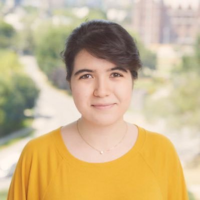

        

            
              
                
            
  <a href="mailto:lily.goli@mail.utoronto.ca">Email</a>  /  <a href="/files/CV.pdf">CV</a>  / <a href="https://scholar.google.com/citations?user=2wnyE-8AAAAJ&hl=en">Scholar</a>  /  <a href="https://github.com/lilygoli">Github</a>  /  <a href="https://twitter.com/lily_goli">Twitter</a>
 
        

        

            
I am a final-year PhD student in Computer Science at the University of Toronto, co-advised by <a href="https://www.cs.toronto.edu/~jacobson" target="_blank" rel="noopener noreferrer">Alec Jacobson</a> and <a href="https://taiya.github.io" target="_blank" rel="noopener noreferrer">Andrea Tagliasacchi</a>. My research focuses on 3D computer vision and graphics, with an emphasis on robust 3D/4D reconstruction, uncertainty estimation, and camera pose estimation. More recently, I have been exploring reinforcement learning methods for embodied agents in 3D worlds.

            
I have interned at <a href="https://waabi.ai/" target="_blank" rel="noopener noreferrer">Waabi AI</a>, Google DeepMind, and <a href="https://wayve.ai/" target="_blank" rel="noopener noreferrer">Wayve</a>, and spent time as a visiting student with <a href="https://people.eecs.berkeley.edu/~kanazawa/" target="_blank" rel="noopener noreferrer">Angjoo Kanazawa</a>'s lab at UC Berkeley. Broadly, I am interested in robust and uncertainty-aware 3D perception, and how it can support learning and decision-making in the real world.

            
Before my PhD, I completed my B.Sc. at Sharif University of Technology, where I also had research internships at TU Munich and UBC.

        

        <h2 style="color: #424242;font-size: 27px; font-family: Helvetica-light, serif;">Selected Publications</h2>

         

            

                
                
 <a href="https://recuriosity.github.io" target="_blank" rel="noopener noreferrer">Page</a> / <a href="https://github.com/recuriosity/recuriosity" target="_blank" rel="noopener noreferrer">Code</a>

            

            

                
 <b>Remember to be Curious: Episodic Context and Persistent Worlds for 3D Exploration</b> 

                
 <b>Lily Goli</b>, Justin Kerr, Daniele Reda, Alec Jacobson, Andrea Tagliasacchi, Angjoo Kanazawa 

                
<i>arXiv 2026</i>

            

        

        

            

                
                
 <a href="https://romosfm.github.io" target="_blank" rel="noopener noreferrer">Page</a> / <a href="https://arxiv.org/abs/2411.18650" target="_blank" rel="noopener noreferrer">Arxiv</a> / <a href="https://github.com/google-deepmind/romo" target="_blank" rel="noopener noreferrer">Code</a>

            

            

                
 <b>RoMo: Robust Motion Segmentation Improves Structure from Motion</b> 

                
 <b>Lily Goli*</b>, Sara Sabour*, Mark Matthews, Marcus Brubaker, Dmitry Lagun, Alec Jacobson, David J. Fleet, Saurabh Saxena*, Andrea Tagliasacchi* 

                
<i>ICCV 2025</i>

            

        
       

        

            

                
                
 <a href="https://spotlesssplats.github.io" target="_blank" rel="noopener noreferrer">Page</a> / <a href="https://arxiv.org/abs/2406.20055" target="_blank" rel="noopener noreferrer">Arxiv</a> / <a href="https://github.com/lilygoli/SpotLessSplats/tree/main" target="_blank" rel="noopener noreferrer">Code</a>

            

            

                
 <b>SpotlessSplats: Ignoring Distractors in 3D Gaussian Splatting</b> 

                
 <b>Lily Goli*</b>, Sara Sabour*, George Kopanas, Mark Matthews, Dmitry Lagun, Leonidas Guibas, Alec Jacobson, David J. Fleet, Andrea Tagliasacchi 

                
<i>Transactions on Graphics (TOG) 2025</i>

            

        

        
        

            

                
                
 <a href="https://theialab.github.io/3dgs-flats/" target="_blank" rel="noopener noreferrer">Page</a> / <a href="https://arxiv.org/abs/2509.16423" target="_blank" rel="noopener noreferrer">Arxiv</a> / <a href="https://github.com/theialab/3dgs-flats/" target="_blank" rel="noopener noreferrer">Code</a>

            

            

                
 <b>3D Gaussian Flats: Hybrid 2D/3D Photometric Scene Reconstruction</b> 

                
 Maria Taktasheva, <b>Lily Goli</b>†, Alessandro Fiorini, Zhen (Colin) Li, Daniel Rebain, Andrea Tagliasacchi† 

                
† Equal advising

                
<i>NeurIPS 2025</i>

            

        

        

            

                
                
 <a href="https://bayesrays.github.io" target="_blank" rel="noopener noreferrer">Page</a> / <a href="https://arxiv.org/abs/2309.03185" target="_blank" rel="noopener noreferrer">Arxiv</a> / <a href="https://github.com/BayesRays/BayesRays/tree/main" target="_blank" rel="noopener noreferrer">Code</a>

            

            

                
 <b>Bayes’ Rays: Uncertainty Quantification for Neural Radiance Fields</b> 

                
 <b>Lily Goli</b>, Cody Reading, Silvia Sellán, Alec Jacobson, Andrea Tagliasacchi 

                
<i>CVPR 2024 (<b>Highlight</b>)</i>

            

        

        

            

                
                
 <a href="https://theialab.github.io/banf/" target="_blank" rel="noopener noreferrer">Page</a> / <a href="" target="_blank" rel="noopener noreferrer">Arxiv</a> / <a href="" target="_blank" rel="noopener noreferrer">Code</a>

            

            

                
 <b>BANF: Band-limited Neural Fields for Levels of Detail Reconstruction</b> 

                
 Ahan Shabanov, Shrisudhan Govindarajan, Cody Reading, <b>Lily Goli</b>, Daniel Rebain, Kwang Moo Yi, Andrea Tagliasacchi 

                
<i>CVPR 2024</i>

            

        

        

            

                
                
 <a href="https://nerf2nerf.github.io" target="_blank" rel="noopener noreferrer">Page</a> / <a href="https://arxiv.org/abs/2211.01600" target="_blank" rel="noopener noreferrer">Arxiv</a> / <a href="https://github.com/nerf2nerf/nerf2nerf" target="_blank" rel="noopener noreferrer">Code</a> / <a href="https://t.co/VNO1VjgWOO" target="_blank" rel="noopener noreferrer">CV News</a>   <a href="/files/nerf2nerf_slides.pdf" target="_blank" rel="noopener noreferrer">Talk at Google Geo (slides)</a>

            

            

                
 <b>nerf2nerf: Pairwise Registration of Neural Radiance Fields</b> 

                
 <b>Lily Goli</b>, Daniel Rebain, Sara Sabour, Animesh Garg, Andrea Tagliasacchi 

                
<i>ICRA 2023, CVPR workshop (<a href="https://sites.google.com/view/xrnerf/">XRNeRF</a>) 2023, Computer Vision News cover (March 2023)</i>

            

        

        

            

                
                
 <a href="https://arxiv.org/abs/2103.07240" target="_blank" rel="noopener noreferrer">Arxiv</a> / <a href="https://github.com/lilygoli/longitudinalCOVID" target="_blank" rel="noopener noreferrer">Code</a>

            

            

                
 <b>Longitudinal Quantitative Assessment of COVID-19 Infection Pro-
gression from Chest CTs</b> 

                
 <b>Lily Goli*</b>, Seong Tae Kim*, Magdalini Paschali, Ashkan Khakzar, Matthias Keicher, Tobias Czempiel, Egon Burian, Rickmer Braren, Nassir Navab, Thomas Wendler 

                
<i>MICCAI 2021</i>

            

        

        <!-- 

            

                
                
 <a href="https://arxiv.org/abs/2103.07640" target="_blank" rel="noopener noreferrer">Arxiv</a>

            

            

                
 <b>Generating Unrestricted Misclassified Examples via Three Parameters</b> 

                
 Hanieh Naderi, <b>Lily Goli</b>, Shohreh Kasaei

                
<i> Multimedia Tools and Applications 2021</i>

            

        
 
        

            

                
                
 <a href="https://ieeexplore.ieee.org/document/9116889" target="_blank" rel="noopener noreferrer">Paper (IEEE Xplore)</a>

            

            

                
 <b>Scale Equivariant CNNs with Scale Steerable Filters</b> 

                
 Hanieh Naderi, <b>Lily Goli</b>, Shohreh Kasaei

                
<i> Machine Vision and Image Processing (MVIP) 2020</i>

            

        
 -->
        
For a full list of publications, please refer to my <a href="https://scholar.google.com/citations?user=2wnyE-8AAAAJ&hl=en" target="_blank" rel="noopener noreferrer">Google Scholar</a> page.

    

